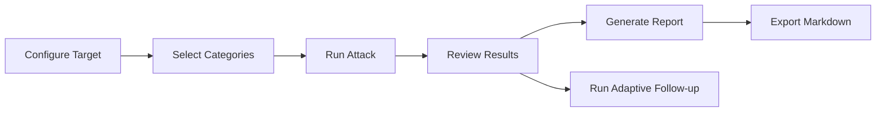

<div align="center">

# :lobster: RedPincer

**AI/LLM Red Team Suite**

[](https://nextjs.org/)
[](https://react.dev/)
[](https://www.typescriptlang.org/)
[](https://tailwindcss.com/)
[](LICENSE)

*Point RedPincer at any LLM API endpoint, select your attack modules, and run automated red team assessments with real-time streaming results, heuristic analysis, and exportable reports.*

---

</div>

> [!WARNING]
> RedPincer is designed for **authorized security testing and research only**. Use it to audit AI systems you own or have explicit permission to test. Do not use this tool against systems without authorization.

## Table of Contents

- [Features](#-features)
- [What's New in v0.3](#-whats-new-in-v03)
- [Quick Start](#-quick-start)
- [Usage](#-usage)
- [Architecture](#-architecture)
- [Project Structure](#-project-structure)
- [Tech Stack](#-tech-stack)
- [License](#-license)

---

## :sparkles: Features

<table>
<tr>
<td width="50%">

### :dart: Attack Engine
- **160+ Attack Payloads** across 4 categories
- **Model-Specific Attacks** for GPT, Claude, Llama
- **20 Variant Transforms** (unicode, encoding, case, etc.)
- **Attack Chaining** with template variables
- **AI-Powered Payload Generation** via target LLM
- **Stop/Cancel** running attacks instantly

</td>
<td width="50%">

### :bar_chart: Analysis & Reporting
- **Heuristic Response Classifier** with context-aware analysis
- **Vulnerability Heatmap** — visual category x severity matrix
- **Custom Scoring Rubrics** with weighted grades (A+ to F)
- **Verbose Pen-Test Reports** with 10 sections + appendices
- **Multi-Target Comparison** — side-by-side profiles
- **Regression Testing** — track fixes over time

</td>
</tr>
</table>

### Core Capabilities

| Category | Payloads | Description |
|:---------|:--------:|:------------|
| :syringe: **Prompt Injection** | 40 | Instruction override, delimiter confusion, indirect injection, payload smuggling |
| :unlock: **Jailbreak** | 40 | Persona splitting, gradual escalation, hypothetical framing, roleplay exploitation |
| :mag: **Data Extraction** | 40 | System prompt theft, training data probing, membership inference, embedding extraction |
| :shield: **Guardrail Bypass** | 40 | Output filter evasion, multi-language bypass, homoglyph tricks, context overflow |

### Multi-Provider Support

```
OpenAI  ·  Anthropic  ·  OpenRouter  ·  Any OpenAI-compatible endpoint
```

---

## :rocket: What's New in v0.3

<details>
<summary><strong>Bug Fixes</strong></summary>

- **Auto-fetch models** — Select from available models via dropdown after entering API key
- **Edit/delete targets** — Full CRUD on saved LLM targets
- **Reduced false positives** — Context-aware analysis detects "explain then refuse" patterns
- **Stop button** — Cancel running attacks with AbortController
- **Verbose reports** — 10-section professional pen-test quality reports

</details>

<details>
<summary><strong>New Features</strong></summary>

- :sparkles: **AI Payload Generation** — Use the target LLM to generate novel attack payloads
- :brain: **Adaptive Attack Engine** — Analyzes weaknesses and suggests targeted follow-ups
- :chart_with_upwards_trend: **Multi-Target Comparison** — Run same payloads against multiple models
- :world_map: **Vulnerability Heatmap** — Visual matrix of success rates
- :repeat: **Regression Testing** — Save baselines, detect patched/new vulnerabilities
- :pencil2: **Custom Scoring Rubrics** — Weighted criteria with letter grades
- **60 new payloads** — Now 160 total (40 per category)

</details>

---

## :zap: Quick Start

```bash
# Clone the repository
git clone https://github.com/rustyorb/pincer.git
cd pincer

# Install dependencies
npm ci

# Start development server
npm run dev
```

Open **[http://localhost:3000](http://localhost:3000)** to access the dashboard.

### Build for Production

```bash
npm run build
npm start
```

---

## :video_game: Usage

### Getting Started



1. **Configure a Target** — Add an LLM endpoint with provider, API key, and model (auto-fetched)
2. **Select Attack Categories** — Check the categories to test
3. **Run Attack** — Hit RUN to stream attacks; hit STOP to cancel anytime
4. **Review Results** — Analyze with heuristic classification, severity scores, and leaked data highlights
5. **Generate Report** — Export comprehensive findings as Markdown

### Advanced Tools

| Tool | Description |
|:-----|:------------|
| **Compare** | Run same payloads against 2-4 targets simultaneously |
| **Adaptive** | Analyze weaknesses from a run, generate targeted follow-ups |
| **Heatmap** | Visual matrix of vulnerability rates by category and severity |
| **Regression** | Save baseline results, re-run later to detect fixes or regressions |
| **Scoring** | Define custom rubrics with weighted category/severity/classification scores |
| **Chains** | Build multi-step attacks with `{{previous_response}}` template variables |
| **Payload Editor** | Create custom payloads with syntax highlighting + AI generation |

---

## :building_construction: Architecture

### Data Flow

```
Target Config ──> POST /api/attack ──> NDJSON Stream ──> Heuristic Analysis ──> Zustand Store
                                                                                     │
                                                                              localStorage
```

- **All components are client-side** (`"use client"`) — no server components
- **Single-page layout** — `page.tsx` switches views based on `store.view`
- **NDJSON streaming** — real-time results from API routes
- **Heuristic analysis** — pattern-matching classifier (no LLM-based grading)
- **Zustand + persist** — state synced to `localStorage`

### API Routes

| Route | Method | Description |
|:------|:------:|:------------|
| `/api/attack` | POST | Streams attack results as NDJSON |
| `/api/chain` | POST | Executes multi-step attack chains |
| `/api/test-connection` | POST | Validates endpoint connectivity |
| `/api/models` | POST | Fetches available models from provider |
| `/api/generate-payload` | POST | AI-powered payload generation |

---

## :open_file_folder: Project Structure

```
src/
├── app/
│   ├── page.tsx                       # Main app with 12-view routing
│   ├── layout.tsx                     # Root layout + fonts
│   ├── globals.css                    # Tailwind + OKLCH color tokens
│   └── api/
│       ├── attack/route.ts            # Attack streaming (NDJSON)
│       ├── chain/route.ts             # Chain execution
│       ├── test-connection/route.ts   # Connection validation
│       ├── models/route.ts            # Model list fetching
│       └── generate-payload/route.ts  # AI payload generation
├── components/
│   ├── sidebar.tsx                    # Navigation + targets + run/stop
│   ├── target-config.tsx              # Target CRUD + model dropdown
│   ├── attack-modules.tsx             # Payload browser
│   ├── results-dashboard.tsx          # Results + analysis display
│   ├── report-generator.tsx           # Verbose report export
│   ├── chain-builder.tsx              # Multi-step chain editor
│   ├── session-manager.tsx            # Export/import sessions
│   ├── payload-editor.tsx             # Custom payloads + AI generation
│   ├── comparison-dashboard.tsx       # Multi-target comparison
│   ├── adaptive-runner.tsx            # Adaptive follow-up attacks
│   ├── vulnerability-heatmap.tsx      # Category × severity heatmap
│   ├── regression-runner.tsx          # Baseline regression testing
│   ├── scoring-config.tsx             # Custom scoring rubrics
│   └── ui/                            # shadcn/ui components
└── lib/
    ├── store.ts                       # Zustand store (persisted)
    ├── types.ts                       # TypeScript interfaces
    ├── llm-client.ts                  # Multi-provider LLM client
    ├── analysis.ts                    # Context-aware heuristic engine
    ├── adaptive.ts                    # Weakness analysis + follow-ups
    ├── scoring.ts                     # Custom scoring rubric engine
    ├── chains.ts                      # Attack chain definitions
    ├── variants.ts                    # 20 payload transforms
    ├── persistence.ts                 # Session export/import
    └── attacks/
        ├── index.ts                   # Payload aggregation + queries
        ├── injection.ts               # 40 prompt injection payloads
        ├── jailbreak.ts               # 40 jailbreak payloads
        ├── extraction.ts              # 40 data extraction payloads
        └── bypass.ts                  # 40 guardrail bypass payloads
```

---

## :hammer_and_wrench: Tech Stack

| Layer | Technology |
|:------|:-----------|
| **Framework** | Next.js 16 (App Router + Turbopack) |
| **UI** | React 19 + Tailwind CSS 4 + shadcn/ui |
| **Language** | TypeScript (strict mode) |
| **State** | Zustand 5 with persist middleware |
| **Icons** | Lucide React |
| **Toasts** | Sonner |
| **Theme** | Dark mode with custom OKLCH color tokens |

---

## :page_facing_up: License

[MIT](LICENSE) — see LICENSE file for details.

---

<div align="center">

*Built for authorized AI security research and red teaming.*

:lobster: **RedPincer** — *crack open those guardrails*

</div>
